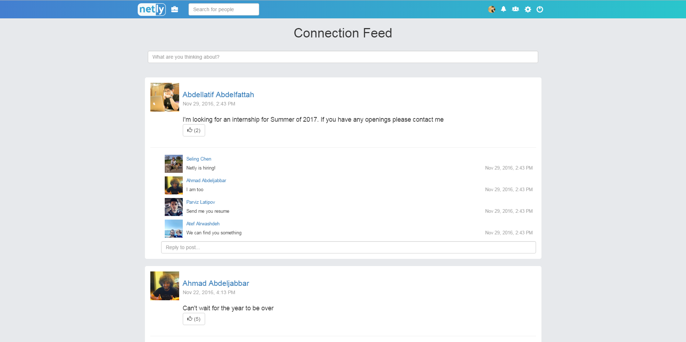
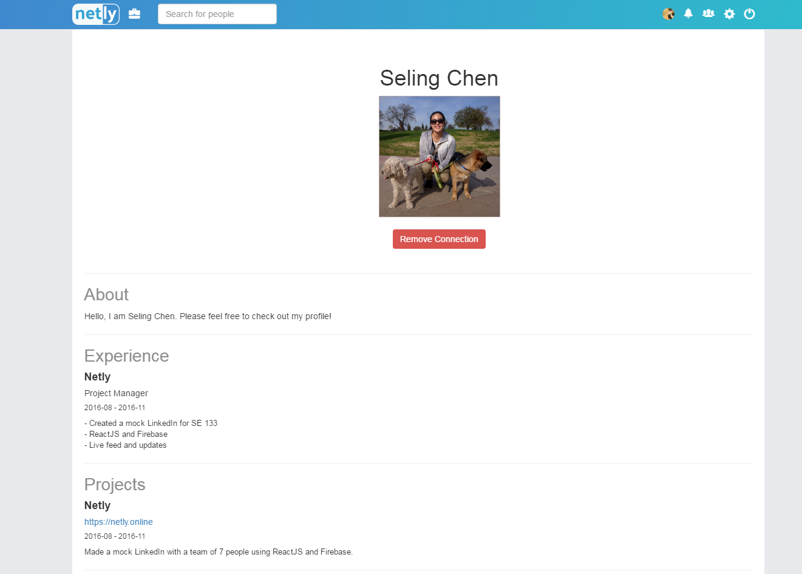
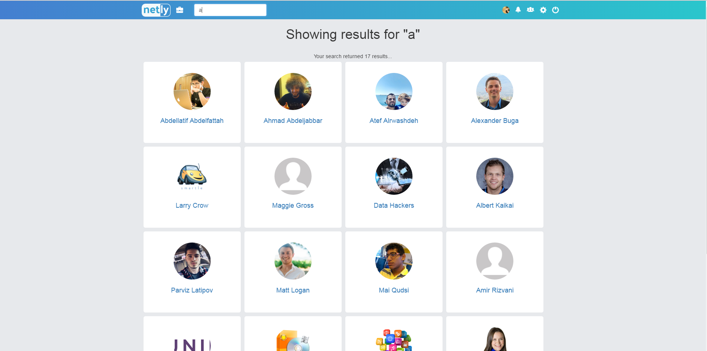

# Netly

### The website is deployed at https://testingproject-cd660.firebaseapp.com/

##### We decided to rebuild Linkedin.com using React.js due to its rising popularity putting in mind the latest trends applied in the framework

### Tech Stack
* React -v "15.3.1"
* Firebase -v "3.4.0"
* Babel-core -v "6.14.0"
* Babel-loader -v "6.2.5"
* Babel-preset-react -v "6.11.1"
* React-dom -v "15.3.1"
* React-router -v "2.8.1"
* Webpack -v "1.13.2"
* Webpack-dev-server -v "1.15.1"
* Bootstrap -v "3.3.7"

### Architecture
We wanted to build a multi-page website instead of the typical one-page websites supported by React.JS, so we followed the [React Router Tutorial](https://github.com/reactjs/react-router-tutorial) to integrate React Router into our application. Learning from [example](https://github.com/tylermcginnis/react-router-firebase-auth/tree/8558713f7ff1e17b7acc3e2e2946377152b1c043), we figured out how to have a fixed navbar at the top of every page in the application but have changing child components upon path changes. Through the CodeAcademy React.JS tutorials [1](https://www.codecademy.com/learn/react-101)+[2](https://www.codecademy.com/learn/react-102), the [Firebase Docs](https://firebase.google.com/docs/web/setup), and trial/error, we have created our own version of Linkedin, [Netly](https://netly.online).

### Installation instructions
0. In *App.js* input your firebase API Keys
1. Set up React.JS - [Link](https://www.codecademy.com/articles/react-setup-v)  
2. Set up Firebase - [Link](https://firebase.google.com/docs/web/setup)  
3. Deploy the Application - [Link](https://firebase.google.com/docs/hosting/)  
	* Change firebase.json's public node to point to <i>build</i>  

### Team
Abdellatif Abdelfattah  
Ahmad Abdeljabbar  
Atef Alrwashdeh  
Chris Van Horn  
Parviz Latipov  
Seling Chen - Team lead  

### Screenshots

#### Live Feed

#### Customizable Profile

#### Real-time search

